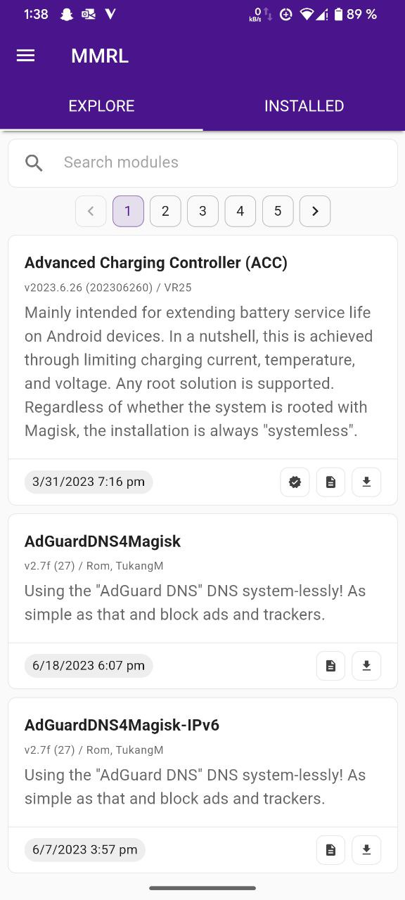
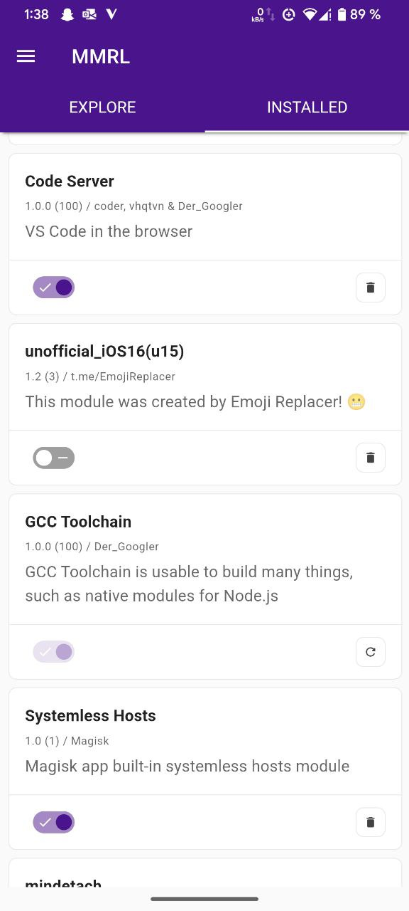

<h1 align="center"><pre>Magisk Modules Repo Loader</pre></h1>

Introducing Magisk Module Repo Loader (MMRL) - the ultimate module manager for Magisk and KernelSU on Android. This highly configurable app allows users to manage modules effortlessly, all while being completely free of ads.

[](https://github.com/DerGoogler/MMRL/actions/workflows/webpack.yml)
[](https://github.com/DerGoogler/MMRL/actions/workflows/codeql-analysis.yml)
[](https://github.com/DerGoogler/MMRL/actions/workflows/android.yml)

## What MMRL Supports (Roadmap)

- [x] Custom repo loading (Since 1.4.2 mutiple repositories are supported)
- [x] Translation
- [x] Dark mode
- [x] Themes
- [ ] Favorite lists

### Android only

- [x] View installed modules
- [x] Remove installed modules
- [x] Enable/Disable installed modules
- [x] Dynamic module configuration
- [x] Module install
- [x] Monet theming

#### Root Manager (Android)

- [x] Magisk
- [x] Magisk Delta
- [x] KernelSU

## Retive configs

```shell
function getconf {
  /system/bin/getprop "$1" "$2" | sed 's/"//g'
}
```

## Screenshots

<table>
<tr>
	<td>
	<td>
<tr>
</table>

## Supported `module.prop` properties

```properties
# Magisk supported properties
id=<string>
name=<string>
version=<string>
versionCode=<int>
author=<string>
description=<string>

# MMRL supported properties
# mmrlConfig=<file> config file get automatically detected
mmrlNoComments=<boolean>
mmrlCover=<url>
mmrlAuthor=<uid>
mmrlLogo=<url>
mmrlScreenshots=<url>,<url>,<url> ...
# Developers that points "Gaming" won't have a change to get verified. Magisk isn't made for gaming purposes.
mmrlCategories=<string>,<string>,<string> ...

# Fox's Mmm supported properties
minApi=<int>
maxApi=<int>
minMagisk=<int>
needRamdisk=<boolean>
support=<url>
donate=<url>
config=<package>
changeBoot=<boolean>
mmtReborn=<boolean>
```

## Supported `module.json` syntax

> **Note** > `prop_url` should always an string otherwise MMRL can't manipulate it.

```json
{
  "last_update": 1658146279000,
  "name": "Googlers Magisk Repo",
  "website": "https://dergoogler.com/repo",
  "support": "https://t.me/The_Googler",
  "donate": null,
  "submitModule": null,
  "modules": [
    {
      "id": "samsung_a70_raven_prop_overlay",
      "last_update": 1654181061000,
      "prop_url": "https://.../module.prop",
      "zip_url": "https://.../master.zip",
      "notes_url": "https://.../README.md"
    }
  ]
}
```

## FAQ

### Why does some description reports `404: Not Found`?

Always create an `README.md` not `readme.md` or something.

### Module props like `changeBoot` or something are not displayed?

The module doesn't have this prop.

### Why does my module aren't displayed?

The MMRL has an own hidding system. This means that bad modules can hidden from an admin.

### How to get an verified module?

**Updated soon**

# Credits & Thanks

- [topjohnwu/libsu](https://github.com/topjohnwu/libsu)
- [Fox2Code/FoxMagiskModuleManager](https://github.com/Fox2Code/FoxMagiskModuleManager)
- [DerGoogler/dgm-cms](https://github.com/DerGoogler/dgm-cms)
- [Hentai-Web/Core](https://github.com/Hentai-Web/Core)
- [Hentai-Web/Android](https://github.com/Hentai-Web/Android)
