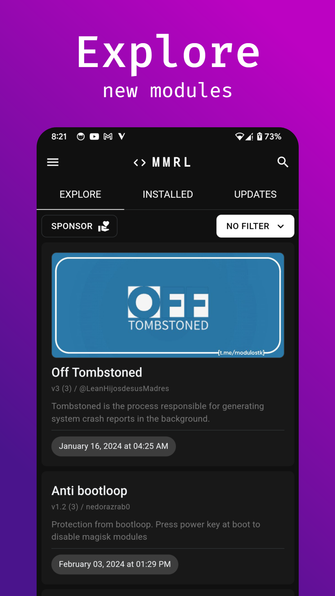
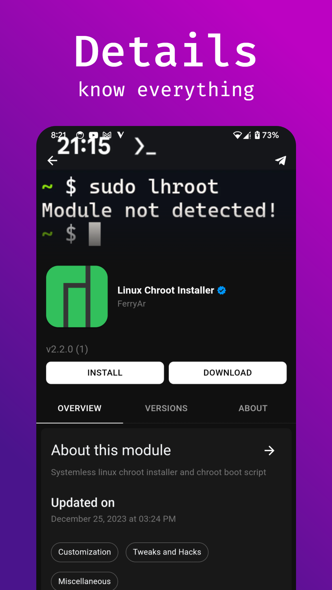
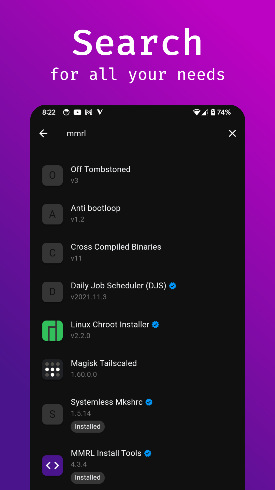
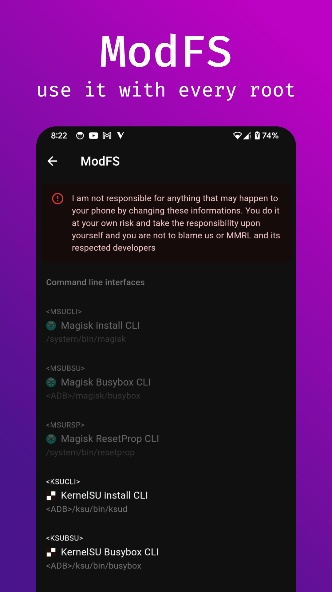

# MMRL

MMRL is an Android app that helps manage your own modules repository.

## Features

- **Comprehensive Root Manager Support**: Full compatibility with Magisk, KernelSU, and APatch for diverse root management options.
- **WebUI with Advanced Features**: Includes [Edge-to-Edge](https://developer.android.com/develop/ui/compose/layouts/insets) support and dynamic app themes for a seamless user experience.
- **Bulk Installation Support**: Effortlessly install modules in bulk, both online and locally.
- **Module Dependency Management**: Simplifies module installation for end-users by automatically handling module dependencies.
- **Magisk Modules Repositories**: A community-driven platform that allows anyone to contribute and access Magisk modules.
- **User Transparency with Blacklist**: Clear visibility into which modules or actions are restricted, ensuring users can make informed decisions.
- **Customizable Module Pages**: Personalize module pages with categories, screenshots, icons, covers, and other content for a tailored presentation.
- **Transparency of Included Files**: Detailed breakdown of all files within modules, including APKs, service files, and more, for full user awareness.
- **Analytics Dashboard**: Display module-related analytics on the homepage, offering valuable insights into module usage and trends.

## Preview

  
  
  
  
  
  

## Supported Versions

- Android 8.0 ~ 14
- Magisk 24.0 ~ latest
- KernelSU 0.5.1 ~ latest
- APatch 10253 ~ latest

## Translate

Get involved with MMRL by translating it into your language!

## Modules Repository

- [MMRLApp/MMRL-Util](https://github.com/MMRLApp/MMRL-Util): A command line interface for building modules repository

## Credits

- [tabler/tabler-icons](https://github.com/tabler/tabler-icons.git)
- [MRepoApp/MRepo](https://github.com/MRepoApp/MRepo)
