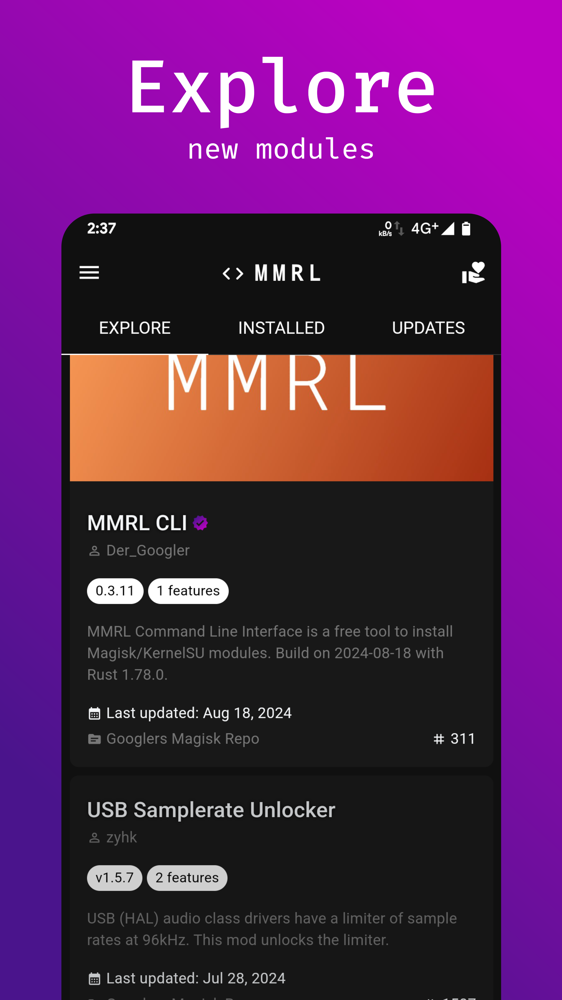
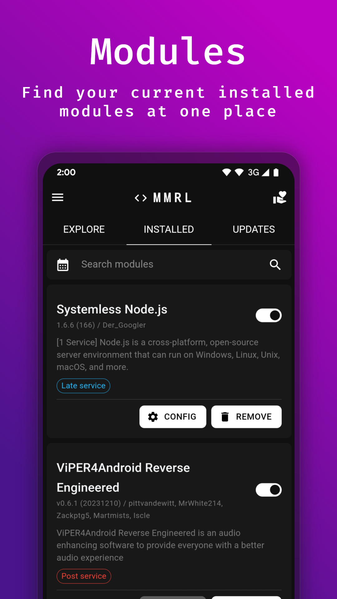
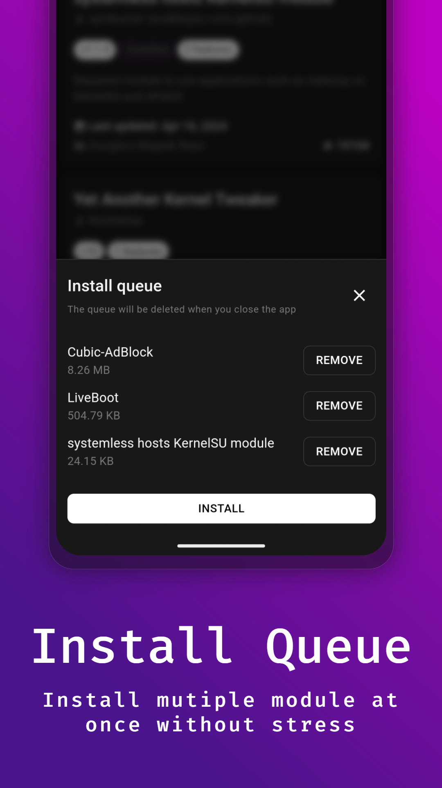
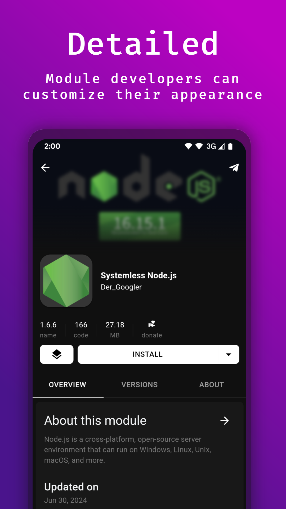
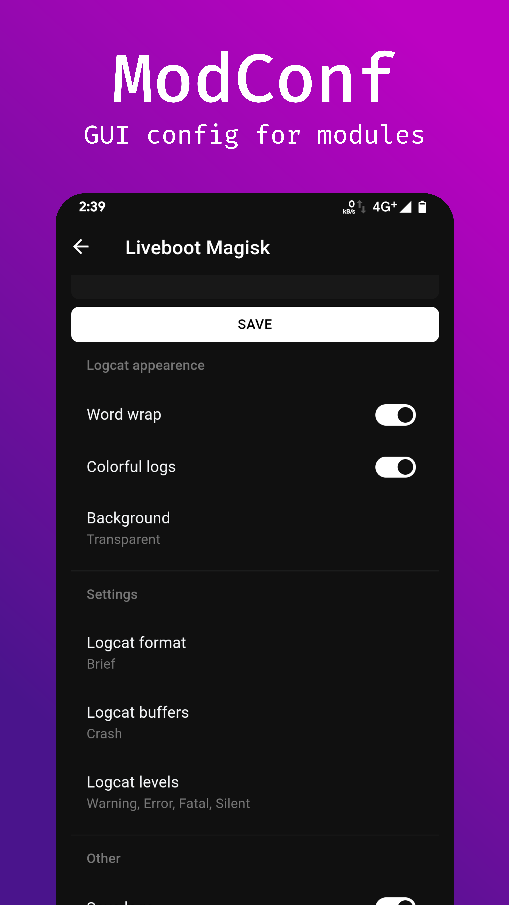

**English** || [Português](README_PT.md)

  
   Your highly customizable module manager</b>

  
  
  

  
  
  

  <a href="https://github.com/DerGoogler/MMRL/blob/master/docs/faq.md">FAQ</a> • 
  <a href="https://github.com/DerGoogler/MMRL/blob/master/docs/ModConf/README.md">ModConf</a> • 
  <a href="https://github.com/DerGoogler/MMRL/blob/master/docs/ModFS.md">ModFS</a> • 
  <a href="https://github.com/DerGoogler/MMRL/blob/master/docs/Installer/README.md">Installer</a>

# Summary

Introducing Magisk Module Repo Loader (MMRL) - the ultimate module manager for Magisk, KernelSU and APatch on Android. This highly configurable app allows users to manage modules effortlessly, all while being completely free of ads.

# Requirements

- Android 8.0 or later
- [MMRL-CLI](https://github.com/DerGoogler/MMRL-CLI)
- 4-5 GB RAM (lower may possible)

# Features

- Basics: Literally basics
- [ModFS](https://github.com/DerGoogler/MMRL/tree/master/docs/ModFS.md): Customizable Module Filesystem
- [ModConf](https://github.com/DerGoogler/MMRL/blob/master/docs/ModConf/README.md): Provide dynamic created pages for modules
- Custom Repos: Load any repo that uses the MRepo or the GR Fork

> Read the [documentation](https://github.com/DerGoogler/MMRL/tree/master/docs) to explore more of our functions like `Shell`, `SuFile` and more

### Supported root manager

- [x] [Magisk](https://github.com/topjohnwu/Magisk)
- [x] [Magisk Delta](https://github.com/HuskyDG/magisk-files)
- [x] [KernelSU](https://github.com/tiann/KernelSU)
- [x] [APatch](https://github.com/bmax121/APatch)

# Screenshots

  
  
  
  
  
  
  

# Credits & Thanks

- [tabler/tabler-icons](https://github.com/tabler/tabler-icons.git)
- [Googlers-Repo/node-native](https://github.com/Googlers-Repo/node-native)
- [topjohnwu/libsu](https://github.com/topjohnwu/libsu)
- [Fox2Code/FoxMagiskModuleManager](https://github.com/Fox2Code/FoxMagiskModuleManager)
- [DerGoogler/dgm-cms](https://github.com/DerGoogler/dgm-cms)
- [Hentai-Web/Core](https://github.com/Hentai-Web/Core)
- [Hentai-Web/Android](https://github.com/Hentai-Web/Android)
