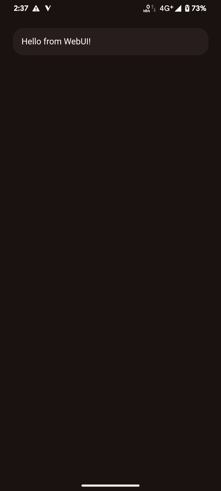

# WebUI in MMRL

MMRL supports WebUI from KernelSU but it come with some additions for you all!

You can use the app theme with automatic dark mode support. Also it supports window safe insets which you'll have to set youself.

| Dark                                                     | Light                                                     |
| -------------------------------------------------------- | --------------------------------------------------------- |
|  |  |

## Setup

To use window safe area insets which you basiclly need here, otherwise your config will move behind the status bar

> Why so?  
> It improves the design and it presents a much more "native" feel

```html
<html lang="en">
  <head>
    <meta charset="UTF-8" />
    <meta name="viewport" content="width=device-width, initial-scale=1.0" />
    <title>ModConf Compose WebUI</title>
    <!-- Window Safe Area Insets -->
    <link rel="stylesheet" type="text/css" href="/mmrl/insets.css" />
    <!-- App Theme which the user has currently selected -->
    <link rel="stylesheet" type="text/css" href="/mmrl/colors.css" />

    <style>
      body {
        padding-top: var(--window-inset-top);
        padding-bottom: var(--window-inset-bottom);
        background-color: var(--background);
      }

      .scafold {
        padding: 16px;
      }

      .card {
        padding: 16px;
        background-color: var(--surfaceContainer);
        border-radius: 20px;
        span {
          color: var(--inverseSurface);
        }
      }
    </style>
  </head>
  <body>
    <div class="scafold">
      <div class="card">
        <span>Hello from WebUI!</span>
      </div>
    </div>
  </body>
</html>
```

## Check if running in MMRL

You can check if the config runs in MMRL

Above v5.30.40

> `$mmrl_wpd` should be replaced with your module ID

```js
if (typeof $mmrl_wpd != "undefined") {
  console.log("Running in MMRL");
} else {
  console.log("Running not in MMRL");
}
```

Below v5.30.40

```js
if (ksu["mmrl"]) {
  console.log("Running in MMRL");
} else {
  console.log("Running not in MMRL");
}
```

Typing

```ts
declare const $mmrl_wpd: MMRL;

interface MMRL {
  /**
   * Returns a JSON string object about the used root solution in MMRL
   * @returns '{"name":"KernelSU","versionName":"1.0.0:KernelSU","versionCode":11874}'
   */
  getManager(): string;

  /**
   * Returns the window top inset. Is the same as CSS 'var(--window-inset-top)'
   */
  getWindowTopInset(): number;

  /**
   * Returns the window bottom inset. Is the same as CSS 'var(--window-inset-bottom)'
   */
  getWindowTopInset(): number;

  /**
   * Returns a boolean to check if the navigation bar is in light
   */
  isLightNavigationBars(): boolean;

  /**
   * Returns a boolean
   */
  isDarkMode(): boolean;

  /**
   * Allows the developer to change the navigation bar icons between light and dark. Runs on activity ui thread
   * @param isLight Change between light and dark
   */
  setLightNavigationBars(isLight: boolean): void;

  /**
   * Returns a boolean to check if the status bar is in light
   */
  isLightStatusBars(): boolean;

  /**
   * Allows the developer to change the status bar icons between light and dark. Runs on activity ui thread
   * @param isLight Change between light and dark
   */
  setLightStatusBars(isLight: boolean): void;

  /**
   * Returns the current platform API of the device
   */
  getSdk(): number;

  /**
   * Allows the developer to share some text
   * @param text Text you wanna share
   */
  shareText(text: string): void;
  /* overload */ shareText(text: string, type: string): void;
}

declare var ksu: ksu;

interface ksu {
  /**
   * @deprecated
   */
  mmrl(): boolean;
}
```


## Launch a WebUI from Shell

```bash
am start -n "com.dergoogler.mmrl/.ui.activity.webui.WebUIActivity" -e MOD_ID "your_id"
```
